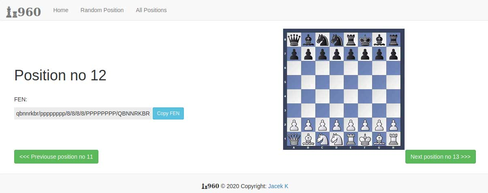

# Fischer chess position generator
> Chess 960 - position generator

## Table of contents
* [General info](#general-info)
* [Screenshots](#screenshots)
* [Technologies](#technologies)
* [Setup](#setup)
* [Features](#features)
* [Status](#status)
* [Credits](#credits)
* [Contact](#contact)

## General info
Position generator - Fisher chess (Chess 960)

## Screenshots
Home Page

All positions

Random position Page

Position Page

## Technologies
* Flask 1.1.2
* Python 3.7
* Bootstrap 

## Setup
Use pip installation to install dependencies from requirements.txt
## Code requirements.txt

`$ pip install -r requirements.txt`

## Features
To-do list:
* Add positions 101-960

## Status
Project is: _in progress_, Positions 101-960

## Credits

## Contact
Created by [Jacek960](mailto:j.kuciel@outlook.com)- feel free to contact me!

